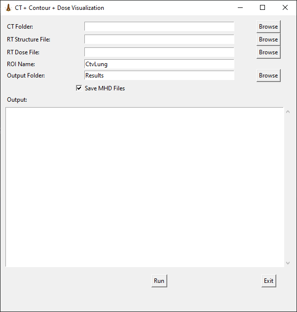
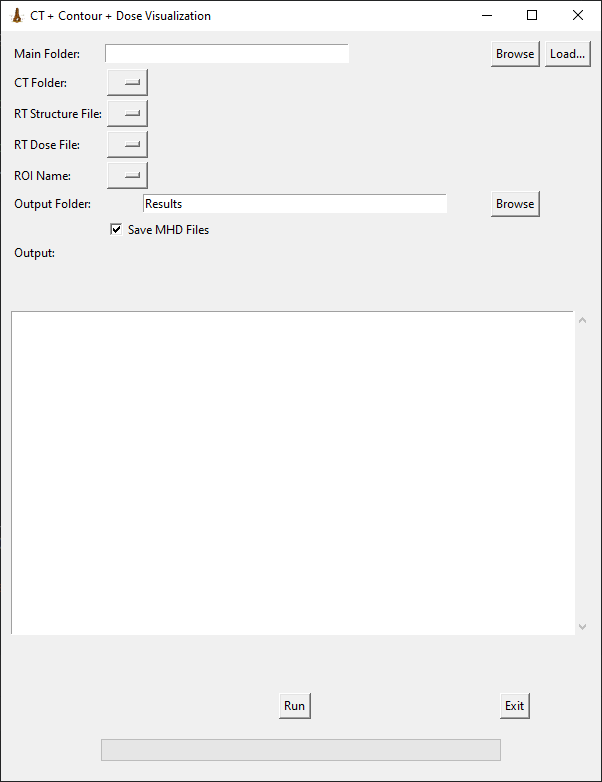
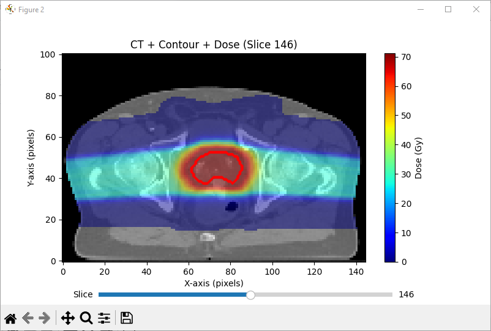
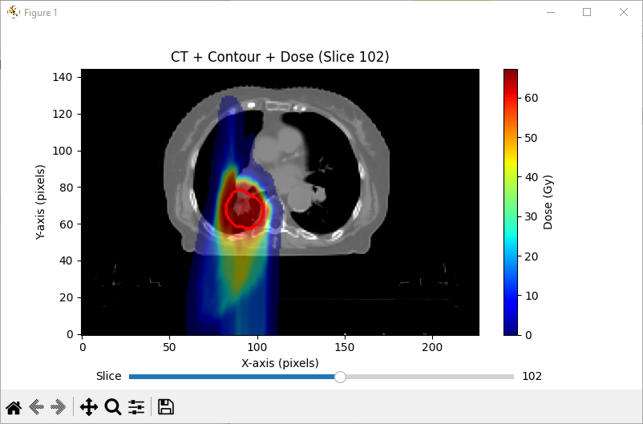

# CT_RS_RD_Match

**CT_RS_RD_Match** is a Python-based medical imaging tool designed for handling **DICOM** files, specifically **CT, RT Structure, and RT Dose** files. The tool extracts, resamples, and visualizes these medical datasets.

---

## Features
- **Load** CT, RT Structure, and RT Dose files
- **Resample** data to match coordinate grids
- **Overlay** dose distribution on CT images
- **Interactive visualization** with scroll-through slices
- **Graphical User Interface (GUI) Support**

---

## Installation
### 🔧 Prerequisites
Ensure you have Python **3.7+** installed along with the following dependencies:
```bash
pip install numpy pydicom SimpleITK matplotlib scipy scikit-image pymedphys tk
```
## GUI Mode
Launch the interactive GUI:
```bash
python CT_RS_RD_Match_GUI.py
```
### Interface GUI_v1

### Interface GUI_v2

### test case1

### test case2
